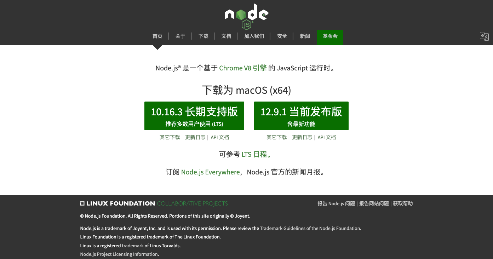

# 目录结构

* 安装 Node.js
* 安装 Git
* 注册 GitHub
* 安装 hexo
* 连接 GitHub 与本地 
* 写文章、发布文章
* 绑定域名
* 设置个性化主题 NexT
* 常见问题与解答（FAQ）  

# 安装 Node.js

### 一、通过 homebrew 安装 node（推荐）

1、安装 homebrew  

* 可以通过 `brew -v` 来查看是否安装了 homebrew，如果能正确显示 homebrew 的版本号，说明 homebrew 已安装

	

* 如果没有安装 homebrew，通过终端命令安装

	`ruby -e "$(curl -fsSL https://raw.githubusercontent.com/Homebrew/install/master/install)"`

2、安装 node

* 在终端中输入命令

	```
	brew link node
	brew uninstall node
	brew install node
	```

* 验证 node 是否安装成功
	
	下发命令 `node -v`、`npm -v`，能正确显示版本号即表示安装成功
	
	
	
* 如果没有梯子的话，可以使用阿里的国内镜像进行加速。

	`npm config set registry https://registry.npm.taobao.org`
	
	参考：[淘宝 NPM 镜像](https://npm.taobao.org/)
	
### 二、通过安装包来安装 node

* 下载安装包

	可以从 [Node.js官方](https://nodejs.org/zh-cn/) 下载 node 的安装包

	

### 三、删除 node

如果之前已经安装过 node，再次安装会产生冲突，需要先删除

* 如果是通过 homebrew 安装的，下发命令 `brew uninstall node` 即可；

* 执行命令行 

	`sudo rm -rf /usr/local/{bin/{node,npm},lib/node_modules/npm,lib/node,share/man/*/node.*}`
	
	

